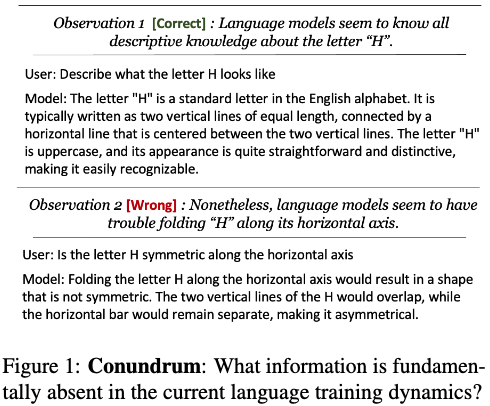
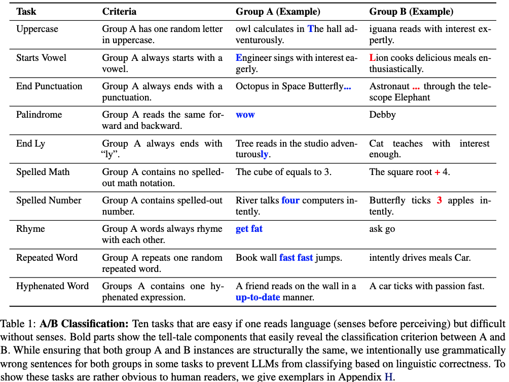

**Status**: Under-Review (Expect Small Changes Here and There)

# Tasks That Language Models Don’t Learn
[Paper](https://arxiv.org/abs/2402.11349)

---

State-of-the-art language models like GPT and LLaMA have shown remarkable performance on a range of linguistic tasks. However, they still struggle with tasks that require the integration of sensory experiences, which are natural to humans. In our paper, we present a series of tasks, termed H-Test, that expose the sensory processing limitations of these language models.

<div style="text-align: center;">

</div>

## TL;DR: Key Findings
**1. Insignificant Intra-Family Improvements.**
- A stronger model in the same model family often does not bring meaningful improvement on the H-Tesst performance.

**2. Number of Examples Has Minimal Impact.**
- The number of examples given neither increases nor decreases performance significantly, strongly hinting that the LLM is simply not learning from H-Test few-shot examples.

**3. Deliberate Reasoning (CoT) Often Decreases Performance.**
- If LLMs benefit from such logical, step-by-step semantic reasoning on H-Test, this can also imply that H-Test is fundamentally solvable by developing stronger language-only models. But CoT decreases performances in general.

**4. Training with more orthography-specific language data does not improve H-Test.**
- We produced 1000 training instances per task in H-Test, and fine-tuned gpt-3.5-turbo-0613 ten different times accordingly. After training for three epochs on each task, we evaluate them on H-Test at k = 50 and observe that no significant performance improvement was achieved.

**5. Multi-modality do not automatically improve H-Test performance.**
-  At the time of writing, LLaVA V1.6 34B is the strongest open-source multi-modal model available. Despite the addition of visual modality, we observe that simply incorporating visual data into the training does not result in a straightforward improvement in H-TEST performance.

**6 (Important). But H-Test is solvable, we just don't know how.**
-  In our paper, we have reported the seemingly unexplainable (jumping) performance improvement on H-Test from GPT-3.5 to GPT-4. This result is important as it shows that H-TEST is indeed solvable (by a GPT-4-level system), but not through conventionally discussed language-only modeling techniques.

## Dataset Details

H-Test is a collection of tasks aimed at investigating the auditory and visual comprehension abilities of language models. These tasks are straightforward for humans but pose a significant challenge to models that lack sensory experiences. H-Test exposes the limitations of models trained exclusively on text data in interpreting sensory-dependent aspects of language.

The raw data files for H-TEST are available in:

- **H-Test:** `htest_generated_with_seed_12062023/*` 
    - 200 A/B classification test instances / 50 few-shot instances (dev) per task
- **Letter Geometry:** `challange_task_generated_with_seed_12062023/letter_geometry_test.jsonl` 
    - additional challenge task for visual reasoning with letters
- **H-Test-style Training Data:** `train/*` 
    - 1000 training instances per task, used for fine-tuning experiments on GPT-3.5-Turbo

Each task within H-TEST requires the model to identify linguistic patterns that are easily recognizable to humans through sensory perception but are challenging for text-only trained models.

<div style="text-align: center;">

</div>

## Running H-Test

(*Research Code*). Use the provided run-*.py files. 

## Citation
```
@misc{lee2024tasks,
      title={Tasks That Language Models Don't Learn}, 
      author={Bruce W. Lee and JaeHyuk Lim},
      year={2024},
      eprint={2402.11349},
      archivePrefix={arXiv},
      primaryClass={cs.CL}
}
```
